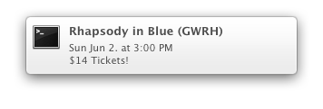

# Holloway

[tsoundcheck](http://www.tso.ca/tsoundcheck/default.aspx) is a program for 
people aged 15 to 35 to buy tickets to Toronto Symphony Orchestra concerts at 
$14 per ticket. 

This script, which is run as a cron job, checks the tsoundcheck website, pulls
the information for on-sale concerts, and displays it in an OS X notification. 
Clicking the notification will bring you straight to the page where you can buy 
tickets. 


## Requirements

* Mac OS X 10.8


## Screenshot

  


## Instructions

1. Install [PhantomJS](http://phantomjs.org/) and 
   [CasperJS](http://casperjs.org/) using Homebrew:

    ```bash
    $ brew update && brew install phantomjs
    $ brew install casperjs
    ```

1. Install Terminal Notifier: 

    ```bash
    $ sudo gem install terminal-notifier
    Password:
    Fetching: terminal-notifier-1.4.2.gem (100%)
    Successfully installed terminal-notifier-1.4.2
    1 gem installed
    Installing ri documentation for terminal-notifier-1.4.2...
    Installing RDoc documentation for terminal-notifier-1.4.2...
    ```

1. `chmod +x check`

1. Find out which directory holds the CasperJS binary:

    ```bash
    $ dirname `which casperjs`
    /usr/local/bin
    ```

    Do the same for terminal-notifier:

    ```bash
    $ dirname `which terminal-notifier`
    /Users/yiqing/.rvm/rubies/ruby-1.9.3-p392/bin
    ```

1. Create a cron job for the `check` script. 

    First do: 
    
    ```bash
    crontab -e
    ````
    
    This will open up the crontab, where you should indicate a frequency, 
    add the directories containing the CasperJS and terminal-notifier binaries
    to your PATH, and finally execute the `check` file using its absolute
    path (the `> /dev/null` just makes sure that you don't get mail every time
    the script runs): 

    ```bash
    0 14 * * * PATH="$PATH:/usr/local/bin/:/Users/yiqing/.rvm/rubies/ruby-1.9.3-p392/bin/" ~/Repos/holloway/check > /dev/null
    ```

    In the above example, the script is run at 2pm every day. 


## References

* [terminal-notifier](https://github.com/alloy/terminal-notifier)
* [How to Create a Cron Job (Scheduled Task) for Your Website or Blog](http://www.thesitewizard.com/general/set-cron-job.shtml)
* [tsoundcheck FAQ](http://www.tso.ca/tsoundcheck/FAQ.aspx)

